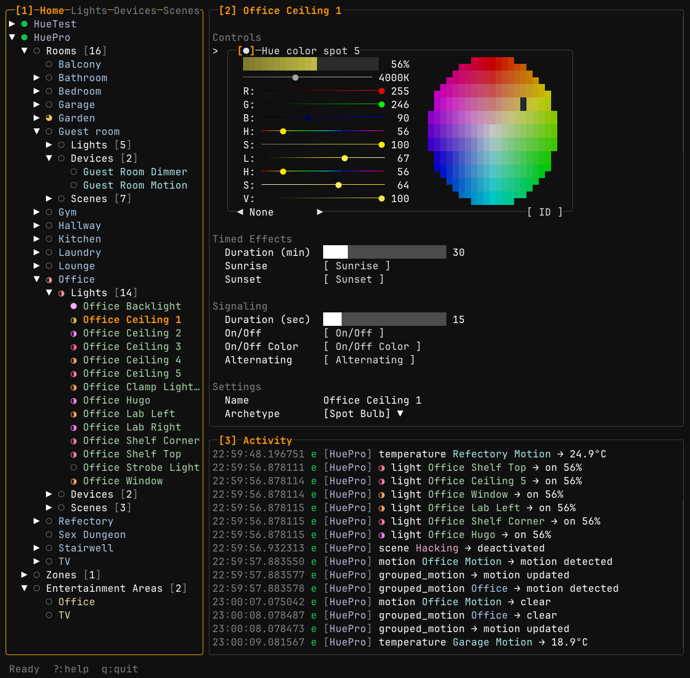

# LazyHue

A terminal user interface (TUI) for managing Philips Hue bridges and lights.
Built with Go and the [Charm](https://charm.sh) ecosystem, LazyHue follows the
lazygit/lazydocker philosophy of keyboard-driven navigation with mouse support.




## Features

### Bridge Management

- Automatic bridge discovery via mDNS
- Easy pairing via link button
- Multiple bridge support with quick switching
- Real-time updates via SSE event stream

### Light Control

- Toggle lights on/off
- Brightness adjustment
- Color picker (XY color space with visual wheel)
- Color temperature control (warm to cool)
- Effects (candle, fire, prism, sparkle, and more)
- Gradient editing for gradient-capable lights

### Entity Management

- View and manage rooms, zones, lights, devices, and scenes
- Create and delete rooms/zones
- Rename any entity with inline editing
- Activate scenes
- Configure motion sensor settings

### Navigation

- Keyboard-driven with vim-style bindings
- Full mouse support (click, scroll, drag)
- Tree view with expand/collapse
- Tabbed views: Home, Lights, Devices, Scenes
- Activity log showing real-time events

## Installation

### Homebrew (macOS)

```bash
brew tap kluzzebass/tap
brew install lazyhue
```

### Download Binary

Pre-built binaries are available for Linux, macOS, and Windows on the
[Releases](https://github.com/kluzzebass/lazyhue/releases) page.

| Platform | Architecture         | Binary                                |
| -------- | -------------------- | ------------------------------------- |
| Linux    | x86_64 (glibc)       | `lazyhue-x86_64-unknown-linux-gnu`    |
| Linux    | x86_64 (musl/static) | `lazyhue-x86_64-unknown-linux-musl`   |
| Linux    | arm64 (glibc)        | `lazyhue-aarch64-unknown-linux-gnu`   |
| Linux    | arm64 (musl/static)  | `lazyhue-aarch64-unknown-linux-musl`  |
| Linux    | armv6                | `lazyhue-arm-unknown-linux-gnueabihf` |
| macOS    | Intel                | `lazyhue-x86_64-apple-darwin`         |
| macOS    | Apple Silicon        | `lazyhue-aarch64-apple-darwin`        |
| Windows  | x86_64               | `lazyhue-x86_64-pc-windows-gnu.exe`   |

### From Source

Requires Go 1.21 or later.

```bash
git clone https://github.com/kluzzebass/lazyhue.git
cd lazyhue
go build -o lazyhue ./cmd/lazyhue
./lazyhue
```

## Usage

### First Run

1. Launch LazyHue
2. It will automatically discover Hue bridges on your network
3. Press `p` to start pairing with a discovered bridge
4. Press the link button on your Hue bridge within 60 seconds
5. Once paired, the bridge connects automatically and you can browse your lights

### Key Bindings

| Key                 | Action                           |
| ------------------- | -------------------------------- |
| `j/k` or `↑/↓`      | Navigate up/down                 |
| `h/l` or `←/→`      | Collapse/expand or prev/next tab |
| `Enter`             | Open details / expand group      |
| `Space`             | Toggle light on/off              |
| `+/-`               | Brightness up/down               |
| `r`                 | Rename selected item             |
| `n/N`               | New room / new zone              |
| `x`                 | Delete selected item             |
| `Tab` / `Shift+Tab` | Next / previous panel            |
| `[` / `]`           | Previous / next bridge           |
| `1/2/3`             | Jump to panel                    |
| `a`                 | Toggle activity log              |
| `p`                 | Pair new bridge                  |
| `?`                 | Show help                        |
| `q`                 | Quit                             |

### Mouse

- Click to select items
- Click and drag sliders
- Scroll to navigate lists
- Click color wheel to pick colors

## Development

```bash
# Run tests
just test

# Format code
just fmt

# Watch for changes and auto-rebuild (requires fswatch)
just watch
```

### Debug Logging

```bash
./lazyhue --debug-log lazyhue.log
```

## Requirements

- A Philips Hue bridge on your local network
- Terminal with true color support (recommended)
- Go 1.21+ (only if building from source)

## License

MIT License - see [LICENSE](LICENSE) file.

## Acknowledgments

Built with:

- [Bubble Tea](https://github.com/charmbracelet/bubbletea) - TUI framework
- [Lip Gloss](https://github.com/charmbracelet/lipgloss) - Styling
- [Bubbles](https://github.com/charmbracelet/bubbles) - TUI components
- [Bubblezone](https://github.com/lrstanley/bubblezone) - Mouse support
