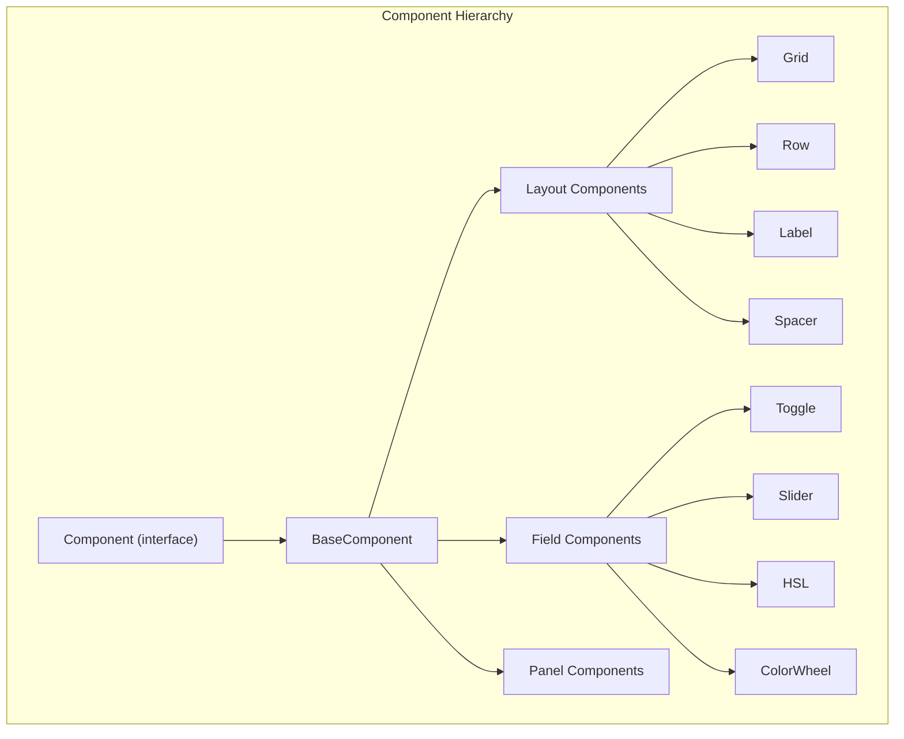
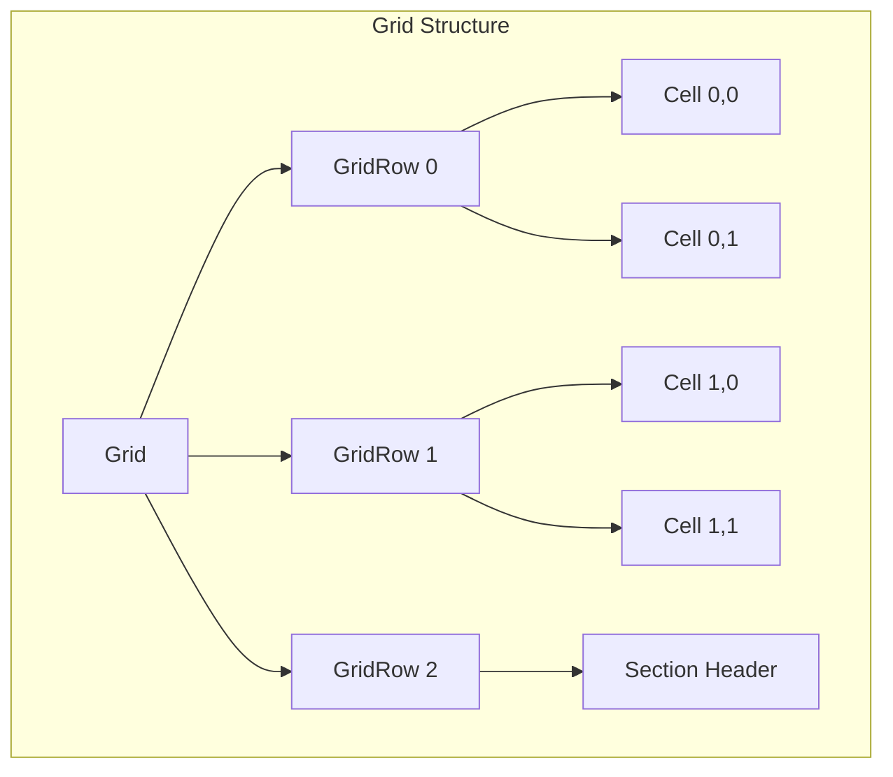
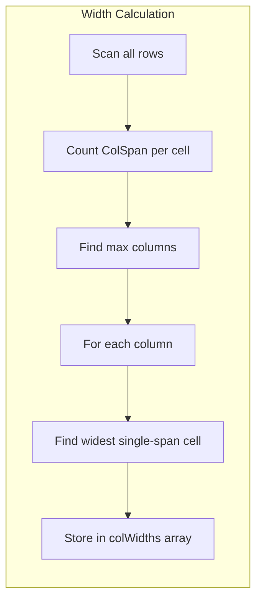
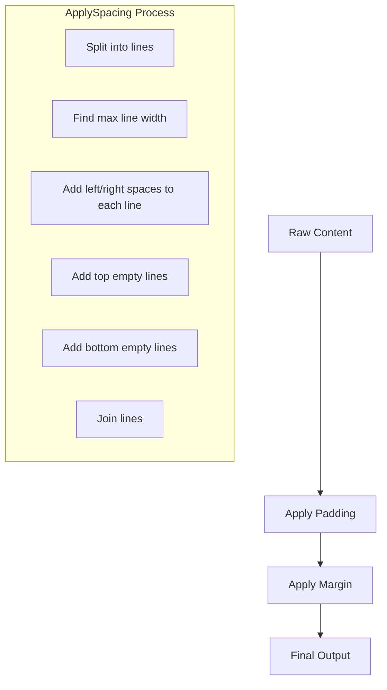
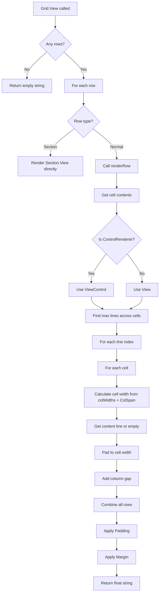
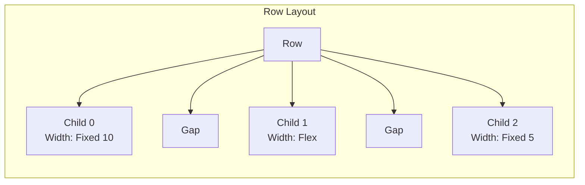
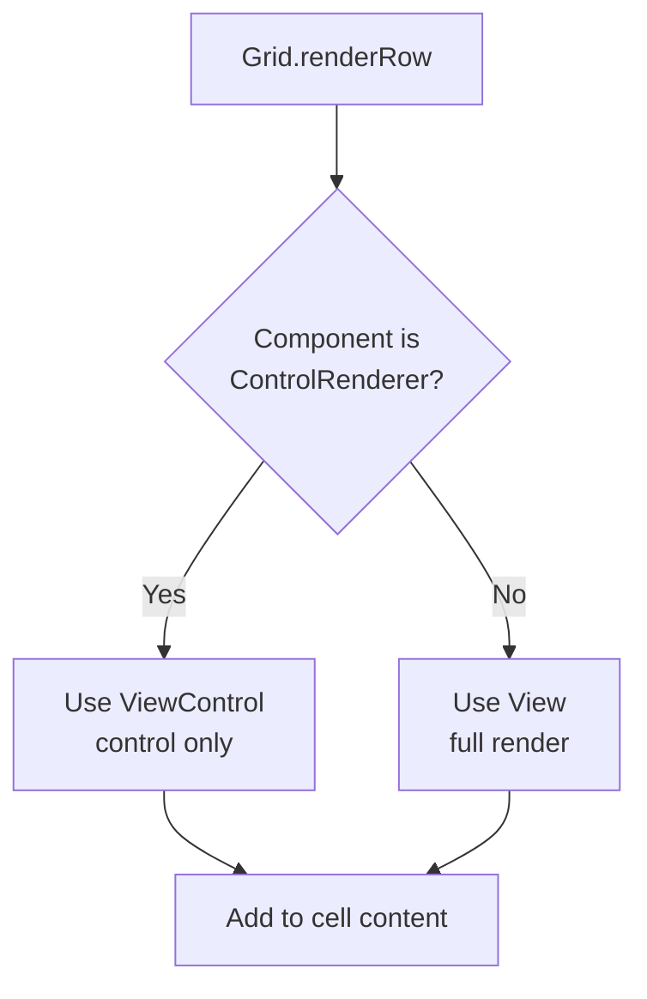
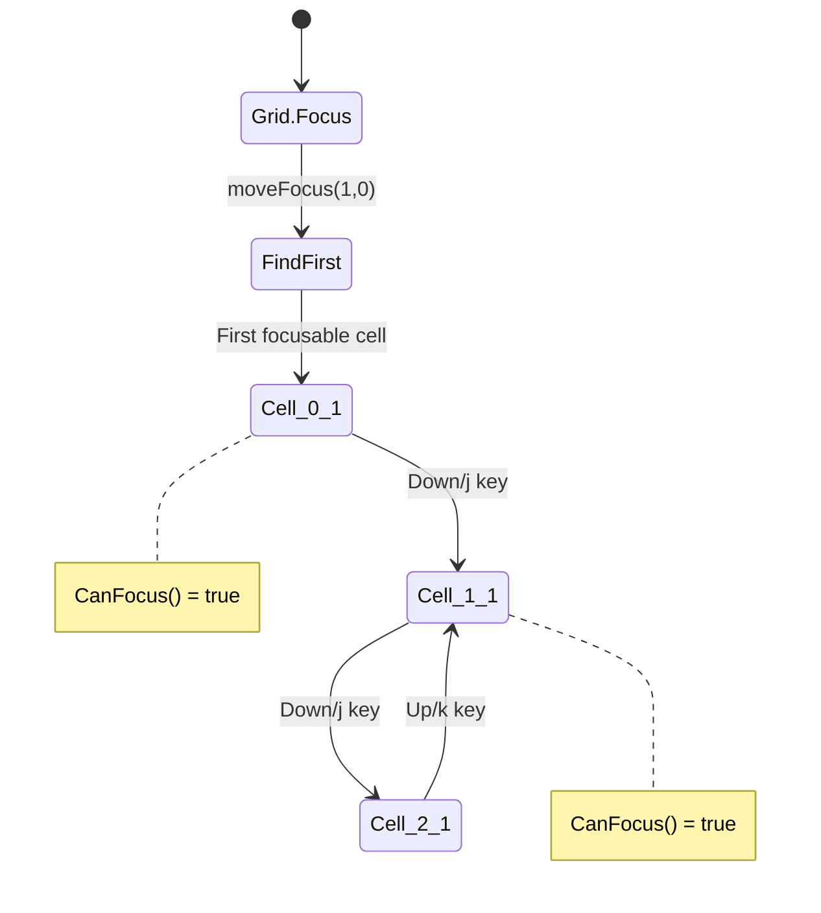

# LazyHue Component System

This document describes the UI component system used in LazyHue v2.

## Architecture Overview



## Component Interface

All UI elements implement the `Component` interface:

```go
type Component interface {
    Layout(bounds Rect)           // Calculate bounds
    Bounds() Rect                 // Get current bounds
    Update(msg tea.Msg) (Component, tea.Cmd)  // Handle events
    RouteEvent(msg tea.Msg) (handled bool, cmd tea.Cmd)  // Route to children
    View() string                 // Render to string

    // Focus management
    IsFocused() bool
    CanFocus() bool
    Focus()
    Blur()

    // Hierarchy
    Children() []Component
    Parent() Component
    SetParent(parent Component)
}
```

---

## Layout Components

Layout components are containers that arrange child components spatially.

### Grid

The `Grid` is a 2D layout container that arranges components in rows and columns.

#### Structure



#### Row Types

| Type | Description |
|------|-------------|
| `RowTypeNormal` | Row with cells arranged in columns |
| `RowTypeSection` | Full-width section header (spans all columns) |

#### GridCell Structure

```go
type GridCell struct {
    Component component.Component
    ColSpan   int     // Number of columns this cell spans (default 1)
    Padding   Spacing // Inner spacing (inside cell, around component)
    Margin    Spacing // Outer spacing (outside cell boundary)
}
```

#### Cell Spanning

Cells can span multiple columns using `ColSpan`:

```
┌─────────────────────────────────────────────────┐
│                     Grid                         │
├──────────────┬──────────────┬──────────────────┤
│   Cell 0     │   Cell 1     │   Cell 2         │
│  (ColSpan=1) │  (ColSpan=1) │  (ColSpan=1)     │
├──────────────┴──────────────┼──────────────────┤
│         Cell 0              │   Cell 1         │
│        (ColSpan=2)          │  (ColSpan=1)     │
├─────────────────────────────┴──────────────────┤
│              Section Header                     │
│           (full width row)                      │
└─────────────────────────────────────────────────┘
```

#### Column Width Calculation

Column widths are automatically calculated based on content:

1. Find maximum number of grid columns from all normal rows
2. For each column, find the widest single-span cell content
3. Multi-span cells don't contribute to individual column widths
4. Uses `ViewControl()` for field components (control only, no label)



---

### Spacing System

All layout components support **Padding** (inner spacing) and **Margin** (outer spacing).

#### Spacing vs Margin vs Padding

```
┌─────────────────────────────────────────────────────────┐
│                        MARGIN                           │
│   ┌─────────────────────────────────────────────────┐   │
│   │                    PADDING                      │   │
│   │   ┌─────────────────────────────────────────┐   │   │
│   │   │                                         │   │   │
│   │   │              CONTENT                    │   │   │
│   │   │                                         │   │   │
│   │   └─────────────────────────────────────────┘   │   │
│   │                                                 │   │
│   └─────────────────────────────────────────────────┘   │
│                                                         │
└─────────────────────────────────────────────────────────┘
```

- **Margin**: Space OUTSIDE the component boundary (between this component and siblings/parent)
- **Padding**: Space INSIDE the component boundary (between boundary and content)

#### Spacing Struct

```go
type Spacing struct {
    Top    int
    Right  int
    Bottom int
    Left   int
}
```

#### Spacing Constructors

| Function | Description | Example |
|----------|-------------|---------|
| `NewSpacing(all)` | Same value all sides | `NewSpacing(2)` → all sides = 2 |
| `NewSpacingXY(x, y)` | Horizontal/vertical | `NewSpacingXY(4, 1)` → left/right=4, top/bottom=1 |
| `NewSpacingTRBL(t,r,b,l)` | Individual sides | `NewSpacingTRBL(1,2,3,4)` → top=1, right=2, bottom=3, left=4 |

#### Grid Spacing Hierarchy

The spacing hierarchy from outermost to innermost:

```
Grid.rowGap           → vertical space between rows
Grid.colGap           → horizontal space between columns
    ↓
GridCell.Margin       → around the cell boundary
GridCell.Padding      → inside cell, around component
    ↓
Component.Margin      → around the component
Component.Padding     → inside the component, around content
```

Visual representation:

```
┌─────────────────────────────────────────────────────────────┐
│                          Grid                               │
│  ┌───────────────────────┐ colGap ┌──────────────────────┐  │
│  │ Cell.Margin           │        │ Cell.Margin          │  │
│  │  ┌─────────────────┐  │        │  ┌────────────────┐  │  │
│  │  │ Cell.Padding    │  │        │  │ Cell.Padding   │  │  │
│  │  │  ┌───────────┐  │  │        │  │  ┌──────────┐  │  │  │
│  │  │  │ Component │  │  │        │  │  │Component │  │  │  │
│  │  │  └───────────┘  │  │        │  │  └──────────┘  │  │  │
│  │  └─────────────────┘  │        │  └────────────────┘  │  │
│  └───────────────────────┘        └──────────────────────┘  │
│                         rowGap                              │
│  ┌───────────────────────┐ colGap ┌──────────────────────┐  │
│  │ Cell.Margin           │        │ Cell.Margin          │  │
│  │  ...                  │        │  ...                 │  │
│  └───────────────────────┘        └──────────────────────┘  │
└─────────────────────────────────────────────────────────────┘
```

#### How Spacing is Applied



---

### Alignment

#### Horizontal Alignment (HAlign)

```
Width = 20 characters
Content = "Hello"

HAlignLeft:   |Hello               |
HAlignCenter: |       Hello        |
HAlignRight:  |               Hello|
```

```go
const (
    HAlignLeft HAlign = iota   // Content flush left, padding right
    HAlignCenter               // Content centered, padding both sides
    HAlignRight                // Content flush right, padding left
)
```

#### Vertical Alignment (VAlign)

```
Height = 5 lines
Content = 2 lines

VAlignTop:      VAlignMiddle:    VAlignBottom:
┌──────────┐    ┌──────────┐    ┌──────────┐
│ Line 1   │    │          │    │          │
│ Line 2   │    │ Line 1   │    │          │
│          │    │ Line 2   │    │          │
│          │    │          │    │ Line 1   │
│          │    │          │    │ Line 2   │
└──────────┘    └──────────┘    └──────────┘
```

```go
const (
    VAlignTop VAlign = iota    // Content at top, padding below
    VAlignMiddle               // Content centered, padding above/below
    VAlignBottom               // Content at bottom, padding above
)
```

---

### Grid Rendering Flow



---

### Grid Visual Example

Given this grid configuration:

```go
grid := NewGrid().SetGaps(2, 0).SetRows([]GridRow{
    {Type: RowTypeNormal, Cells: []GridCell{
        {Component: NewLabel("Power")},
        {Component: toggleControl},
    }},
    {Type: RowTypeNormal, Cells: []GridCell{
        {Component: NewLabel("Brightness")},
        {Component: brightnessSlider},
    }},
    {Type: RowTypeNormal, Cells: []GridCell{
        {Component: NewLabel("Color")},
        {Component: hueSlider},
    }},
    {Type: RowTypeNormal, Cells: []GridCell{
        {Component: NewSpacer(0)},
        {Component: satSlider},
    }},
})
```

Renders as:

```
Power       ○ On
Brightness  ████████████░░░░░░░░ 60%
Color       ████████████████████ 180°
            ████████████████████ 75%
↑           ↑                    ↑
│           │                    │
│           │                    └── Cell 1 content
│           └── Column gap (2 spaces)
└── Cell 0 (label column, auto-width = 10)
```

---

### Row Component

`Row` is a horizontal layout container that renders children side-by-side.



#### Row Child Width

| Width Value | Behavior |
|-------------|----------|
| `Width: 10` | Fixed width of 10 characters |
| `Width: 0` | Flex - takes remaining space |

#### Multi-line Row Alignment

When children have different heights, VAlign controls vertical positioning:

```
VAlignTop:           VAlignMiddle:        VAlignBottom:
┌────┬────────┐      ┌────┬────────┐      ┌────┬────────┐
│ A  │ Line 1 │      │    │ Line 1 │      │    │ Line 1 │
│    │ Line 2 │      │ A  │ Line 2 │      │    │ Line 2 │
│    │ Line 3 │      │    │ Line 3 │      │ A  │ Line 3 │
└────┴────────┘      └────┴────────┘      └────┴────────┘
```

---

### Label Component

Simple text display component (cannot be focused).

```go
type Label struct {
    Text    string   // The text to display
    Width   int      // Padded width (0 = natural width)
    Height  int      // Padded height (0 = natural height)
    Style   lipgloss.Style
    Padding Spacing  // Inner spacing
    Margin  Spacing  // Outer spacing
    HAlign  HAlign   // Horizontal alignment within Width
    VAlign  VAlign   // Vertical alignment within Height
}
```

#### Label Width and Alignment

```
Label: "Hi", Width: 10

HAlignLeft:   |Hi        |
HAlignCenter: |    Hi    |
HAlignRight:  |        Hi|
```

---

### Spacer Component

Takes up space without rendering visible content. Used for:
- Creating consistent indentation
- Alignment placeholders in grids
- Visual separation

```go
type Spacer struct {
    Width   int      // Horizontal size
    Height  int      // Vertical size (lines)
    Padding Spacing
    Margin  Spacing
}
```

---

## Field Components

Field components are interactive form controls. They implement the `ControlRenderer` interface:

```go
type ControlRenderer interface {
    ViewControl() string   // Render ONLY the control (no label)
    FieldLabel() string    // Return the label text
    FieldHeight() int      // Return number of rows
}
```

### Why ControlRenderer?

When fields are placed in a Grid:
- The Grid adds a Label in column 0
- The field goes in column 1
- If field.View() rendered its own label, it would appear twice

Solution: Grid checks for `ControlRenderer` and uses `ViewControl()` instead of `View()`.



---

## Focus Management

### Focus Flow in Grid



### Focus Navigation Rules

1. Only `RowTypeNormal` rows can receive focus
2. `RowTypeSection` rows are skipped during navigation
3. Labels and Spacers return `CanFocus() = false`
4. Grid maintains `focusRow` and `focusCol` indices
5. When moving, current cell is blurred, new cell is focused

---

## Complete Grid Example

```
┌─────────────────────────────────────────────────────────┐
│ Power      │ gap │ ○ On                                 │
│ Brightness │ gap │ ████████░░░░░ 60%                    │
│ Color      │ gap │ ████████████░░ 180°                  │
│            │ gap │ ██████████████ 75%                   │
│            │ gap │ ██████████████ 50%                   │
└─────────────────────────────────────────────────────────┘
     ↑          ↑              ↑
     │          │              │
     │          │              └── Column 1 (controls)
     │          └── colGap (default: 2)
     └── Column 0 (labels, width = max label length)
```

### Grid Properties Summary

| Property | Type | Default | Description |
|----------|------|---------|-------------|
| `rows` | `[]GridRow` | `nil` | The grid rows |
| `colWidths` | `[]int` | calculated | Auto-calculated column widths |
| `colGap` | `int` | `2` | Space between columns |
| `rowGap` | `int` | `0` | Extra lines between rows |
| `focusRow` | `int` | `0` | Currently focused row index |
| `focusCol` | `int` | `0` | Currently focused column index |

### GridCell Properties Summary

| Property | Type | Default | Description |
|----------|------|---------|-------------|
| `Component` | `component.Component` | `nil` | The component to render in this cell |
| `ColSpan` | `int` | `1` | Number of columns this cell spans |
| `Padding` | `Spacing` | all 0 | Inner spacing (inside cell, around component) |
| `Margin` | `Spacing` | all 0 | Outer spacing (outside cell boundary) |

---

## Usage Example

```go
// Create a form grid for light controls
grid := layout.NewGrid().
    SetGaps(2, 0).
    SetRows([]layout.GridRow{
        // Header section
        {Type: layout.RowTypeSection, Section: layout.NewLabel("Light Settings")},

        // Power row: Label + Toggle (with cell padding example)
        {Type: layout.RowTypeNormal, Cells: []layout.GridCell{
            {Component: layout.NewLabel("Power")},
            {Component: powerToggle, Padding: layout.NewSpacingXY(1, 0)},
        }},

        // Brightness row: Label + Slider
        {Type: layout.RowTypeNormal, Cells: []layout.GridCell{
            {Component: layout.NewLabel("Brightness")},
            {Component: brightnessSlider},
        }},

        // HSL rows: Label + Hue, then Spacer + Sat, Spacer + Light
        {Type: layout.RowTypeNormal, Cells: []layout.GridCell{
            {Component: layout.NewLabel("Color")},
            {Component: hueSlider},
        }},
        {Type: layout.RowTypeNormal, Cells: []layout.GridCell{
            {Component: layout.NewSpacer(0)},
            {Component: satSlider},
        }},
        {Type: layout.RowTypeNormal, Cells: []layout.GridCell{
            {Component: layout.NewSpacer(0)},
            {Component: lightSlider},
        }},
    })
```
