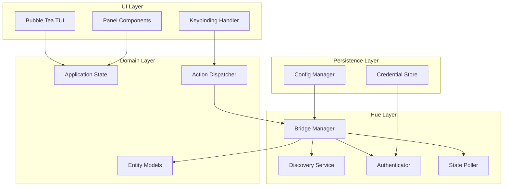
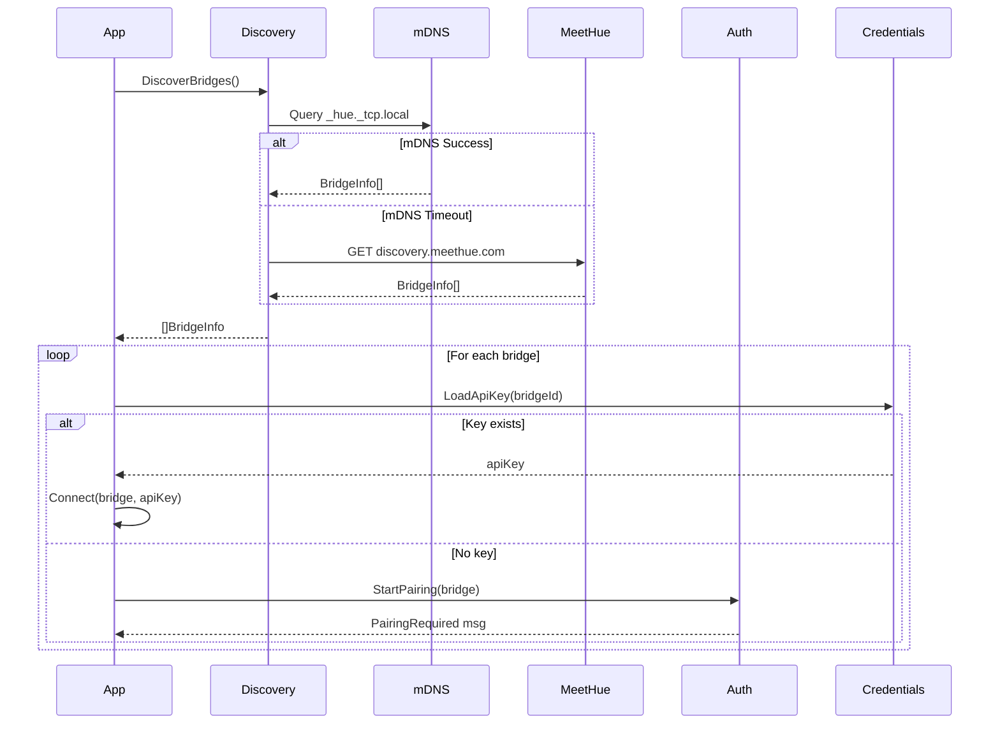
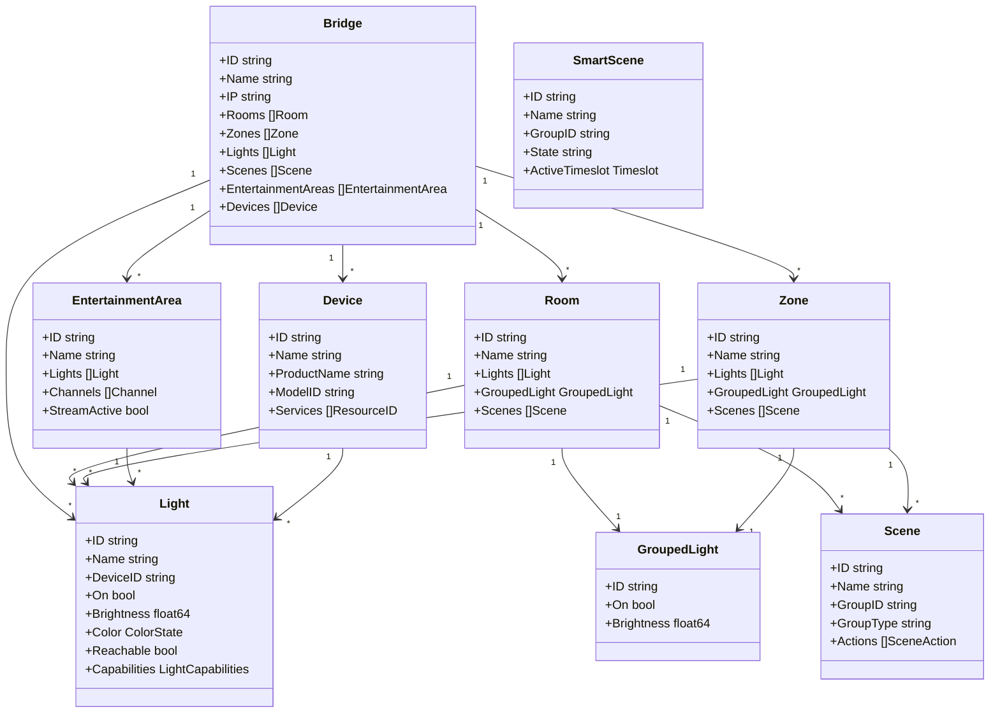
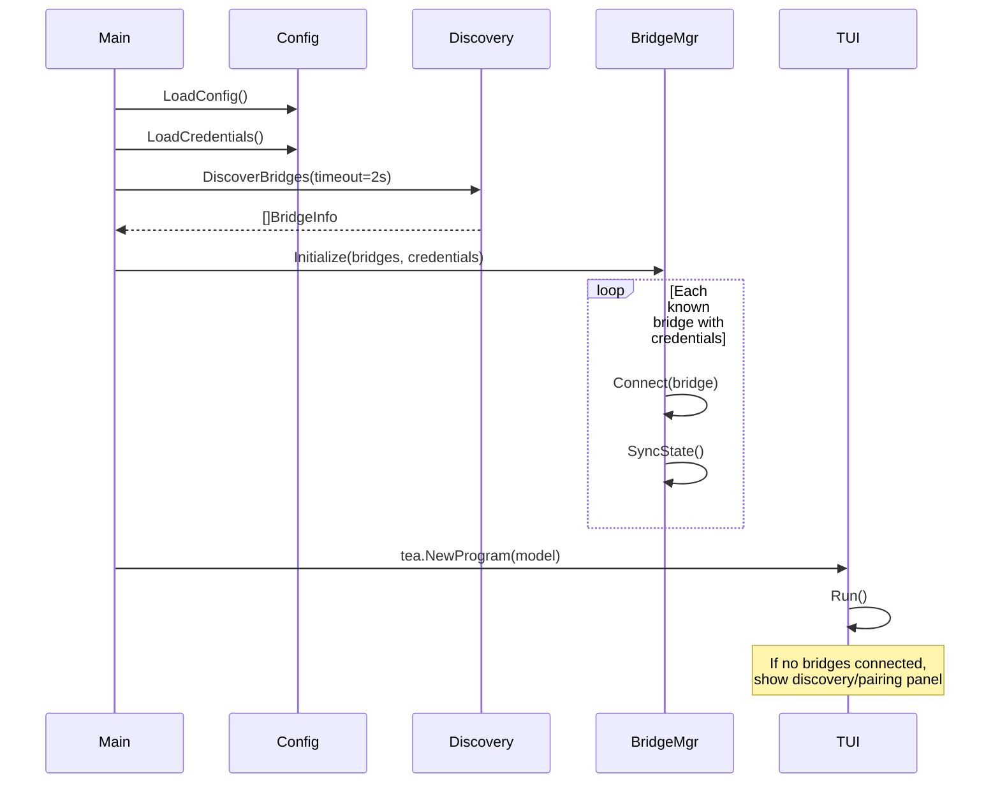

# lazyhue Technical Design Plan

## High-Level Architecture



---

## 1. Package Structure

```
lazyhue/
├── cmd/
│   └── lazyhue/
│       └── main.go              # Entry point, program setup
├── internal/
│   ├── app/
│   │   ├── app.go               # Root Bubble Tea model
│   │   ├── state.go             # Centralized application state
│   │   └── messages.go          # Custom tea.Msg types
│   ├── ui/
│   │   ├── layout.go            # Panel layout management
│   │   ├── theme.go             # Colors, styles (lipgloss)
│   │   ├── keys.go              # Keybinding definitions
│   │   ├── help.go              # Help overlay component
│   │   └── panels/
│   │       ├── bridges.go       # Bridge selector panel
│   │       ├── entities.go      # Entity list panel (lights/rooms/zones)
│   │       ├── details.go       # Entity details panel
│   │       ├── scenes.go        # Scene browser panel
│   │       └── status.go        # Status bar component
│   ├── hue/
│   │   ├── bridge.go            # Bridge connection wrapper
│   │   ├── manager.go           # Multi-bridge coordinator
│   │   ├── discovery.go         # Discovery orchestration
│   │   ├── auth.go              # Authentication flow handler
│   │   ├── poller.go            # Background state synchronization
│   │   └── events.go            # Bridge event types
│   ├── domain/
│   │   ├── light.go             # Light entity model
│   │   ├── room.go              # Room entity model
│   │   ├── zone.go              # Zone entity model
│   │   ├── scene.go             # Scene and SmartScene models
│   │   ├── group.go             # Grouped light abstraction
│   │   ├── device.go            # Physical device model
│   │   ├── entertainment.go     # Entertainment area model
│   │   └── relationships.go     # Entity relationship mapping
│   └── config/
│       ├── config.go            # Configuration loading/saving
│       └── credentials.go       # Secure credential storage
├── go.mod
└── go.sum
```

**Design Rationale:**

- `internal/` prevents external imports, keeping the API surface clean
- Separation of `ui/`, `hue/`, `domain/`, `config/` enforces clear boundaries
- `panels/` as a subdirectory allows each panel to be self-contained
- Domain models are decoupled from openhue-go types to allow abstraction

---

## 2. Bridge Discovery and Connection

### Discovery Flow



### Multi-Bridge Architecture

```go
// Pseudocode: Bridge Manager
type BridgeManager struct {
    bridges     map[string]*BridgeConnection  // keyed by bridge ID
    activeBridge string
    poller      *Poller
}

type BridgeConnection struct {
    info        BridgeInfo
    home        *openhue.Home
    state       *BridgeState      // cached entities
    lastSync    time.Time
    status      ConnectionStatus  // connected, disconnected, pairing
}
```

**Key Decisions:**

- Use openhue-go's `BridgeDiscovery` with 2-second mDNS timeout, fallback to meethue.com
- Store API keys in `~/.config/lazyhue/credentials.json` with 0600 permissions
- Connection status tracked per-bridge to handle partial connectivity
- Pairing UI shows inline in a modal, polling for link button press

### Credential Storage

```go
// ~/.config/lazyhue/credentials.json
type CredentialStore struct {
    Bridges map[string]BridgeCredential `json:"bridges"`
}

type BridgeCredential struct {
    BridgeID   string `json:"bridge_id"`
    BridgeName string `json:"bridge_name"`
    ApiKey     string `json:"api_key"`
    LastUsed   string `json:"last_used"`
}
```

**Security Note:** API keys are stored in plaintext. Future enhancement could integrate with system keychain via `go-keyring`. For Stage 1, file permissions are sufficient.

### Error Handling Strategy

| Scenario | Behavior |
|----------|----------|
| No bridges found | Show discovery panel with retry option |
| Bridge unreachable | Mark disconnected, show in status bar, continue with others |
| Auth key rejected | Clear stored key, prompt re-pairing |
| Partial API failure | Log error, show stale data indicator, retry on next poll |

---

## 3. Entity Modeling

### Domain Model Hierarchy



### Entity Relationships

The Hue v2 API uses resource references. Key mappings:

| Entity | Contains | Controllable Via |
|--------|----------|------------------|
| Room | Lights (by device assignment) | GroupedLight service |
| Zone | Lights (arbitrary grouping) | GroupedLight service |
| Light | - | Direct LightPut |
| Scene | Actions for a room/zone | Recall action |
| SmartScene | Time-based scene automation | State toggle (active/inactive) |
| Entertainment Area | Lights with spatial positions | Entertainment streaming API |
| Device | Physical hardware, hosts services | Identify, rename |

### Translation from openhue-go

```go
// Pseudocode: Converting openhue types to domain types
func (b *BridgeConnection) SyncState(ctx context.Context) error {
    rooms, _ := b.home.GetRooms()
    lights, _ := b.home.GetLights()
    scenes, _ := b.home.GetScenes()
    zones, _ := b.home.GetZones()
    groupedLights, _ := b.home.GetGroupedLights()
    
    // Build relationship graph
    b.state = &BridgeState{
        Rooms:  mapRooms(rooms, lights, scenes, groupedLights),
        Zones:  mapZones(zones, lights, scenes, groupedLights),
        Lights: mapLights(lights),
        Scenes: mapScenes(scenes),
    }
    return nil
}
```

---

## 4. TUI Layout and Navigation

### Primary Layout

```
┌─────────────────────────────────────────────────────────────────────┐
│ lazyhue │ Bridge: Living Room Hub (192.168.1.50) │ ● Connected     │  <- Header
├────────────────────┬────────────────────────────────────────────────┤
│ [1] Rooms          │                                                │
│ ────────────────── │  Living Room                                   │
│ > Living Room   ● │  ──────────────────────────────                │
│   Bedroom       ○ │  Status: 3/4 lights on                         │
│   Kitchen       ● │  Brightness: 80%                               │
│   Office        ○ │                                                │
│                    │  Lights:                                       │
│ [2] Zones          │    Ceiling Lamp      ● 100%                   │
│ ────────────────── │    Floor Lamp        ● 60%                    │
│   Downstairs       │    Table Light       ○ Off                    │
│   Upstairs         │    Strip Light       ● 80%                    │
│                    │                                                │
│ [3] Scenes         │  Scenes:                                       │
│ ────────────────── │    Energize  Relax  Concentrate  Dimmed       │
│   Energize         │                                                │
│   Relax            │                                                │
│   Concentrate      │                                                │
├────────────────────┴────────────────────────────────────────────────┤
│ ↑↓ navigate  ⏎ toggle  b brightness  c color  s scene  ? help     │  <- Status bar
└─────────────────────────────────────────────────────────────────────┘
```

### Panel Architecture

| Panel | Purpose | Component |
|-------|---------|-----------|
| Entity List (left) | Browse rooms/zones/all lights | `bubbles/list` with custom delegate |
| Detail View (right) | Show selected entity details, child lights, scenes | `bubbles/viewport` with dynamic content |
| Header | Bridge selector, connection status | Static render |
| Status Bar | Context-sensitive keybindings, messages | Static render |
| Help Overlay | Full keybinding reference | Modal with `bubbles/viewport` |

### Focus Model

```go
type FocusRegion int

const (
    FocusEntityList FocusRegion = iota
    FocusDetailView
    FocusScenePicker
    FocusBridgeSelector
    FocusHelpOverlay
)
```

- `Tab` / `Shift+Tab` cycles focus between major regions
- `h` / `l` (vim-style) also switch left/right panels
- `1`, `2`, `3` jump to Rooms, Zones, Scenes sections in entity list
- Focus state determines which keybindings are active

### Bridge Switching

- Header shows current bridge name/IP
- `B` opens bridge picker (popup list)
- `[` / `]` cycle through connected bridges quickly
- Disconnected bridges shown with indicator, selectable to attempt reconnect

---

## 5. Keybinding Design

### Core Navigation

| Key | Action | Context |
|-----|--------|---------|
| `j` / `↓` | Move cursor down | List panels |
| `k` / `↑` | Move cursor up | List panels |
| `g` | Jump to top | List panels |
| `G` | Jump to bottom | List panels |
| `Tab` | Next panel | Global |
| `Shift+Tab` | Previous panel | Global |
| `Enter` | Expand/select item | Entity list |
| `Esc` | Close overlay / deselect | Global |
| `q` | Quit | Global |
| `?` | Toggle help overlay | Global |

### Light/Group Actions

| Key | Action | Context |
|-----|--------|---------|
| `Space` | Toggle on/off | Light or group selected |
| `o` | Turn on | Light or group selected |
| `O` | Turn off | Light or group selected |
| `b` | Brightness picker (slider) | Light or group selected |
| `+` / `=` | Increase brightness 10% | Light or group selected |
| `-` | Decrease brightness 10% | Light or group selected |
| `c` | Color picker | Color-capable light |
| `t` | Color temperature picker | CT-capable light |

### Scene Actions

| Key | Action | Context |
|-----|--------|---------|
| `s` | Open scene picker for current room/zone | Room or zone selected |
| `Enter` | Activate scene | Scene list |
| `1`-`9` | Quick-activate scene by position | Scene list visible |

### Bulk Operations

| Key | Action | Context |
|-----|--------|---------|
| `v` | Enter visual/multi-select mode | Entity list |
| `a` | Select all in current section | Visual mode |
| `Space` | Toggle selection | Visual mode |
| `Enter` | Apply action to selection | Visual mode |

### Bridge Management

| Key | Action |
|-----|--------|
| `B` | Open bridge picker |
| `[` | Previous bridge |
| `]` | Next bridge |
| `R` | Refresh/resync current bridge |
| `P` | Pair new bridge |

### Mouse Support

Like lazygit, mouse interaction is fully supported as a complement to keyboard navigation:

- Click to select items in lists
- Click to switch focus between panels
- Scroll wheel for list/viewport navigation
- Double-click to activate (toggle light, recall scene)
- Mouse support enabled via `tea.WithMouseCellMotion()` program option

This provides accessibility for users who prefer mouse interaction while maintaining keyboard-first design.

### Discoverability

- Status bar shows 4-5 most relevant keys for current context
- `?` opens full help overlay organized by category
- Keys are grouped logically (navigation, actions, bulk, system)
- Conflicting keys are avoided by context separation

---

## 6. State Management and Concurrency

### Bubble Tea Model Structure

```go
type Model struct {
    // UI State
    focus        FocusRegion
    entityList   list.Model
    detailView   viewport.Model
    scenePicker  list.Model
    bridgePicker list.Model
    helpOverlay  viewport.Model
    showHelp     bool
    
    // Domain State
    bridges      *hue.BridgeManager
    activeBridge string
    
    // Derived/Cached
    currentEntities []domain.Entity
    selectedEntity  domain.Entity
    
    // System
    width, height int
    err           error
    statusMsg     string
}
```

### Message Types

```go
// Bridge lifecycle
type BridgesDiscoveredMsg struct { Bridges []hue.BridgeInfo }
type BridgeConnectedMsg struct { BridgeID string }
type BridgeDisconnectedMsg struct { BridgeID string; Err error }
type PairingRequiredMsg struct { Bridge hue.BridgeInfo }
type PairingSuccessMsg struct { BridgeID string; ApiKey string }

// State sync
type StateSyncedMsg struct { BridgeID string; State *domain.BridgeState }
type StateSyncErrorMsg struct { BridgeID string; Err error }

// Actions
type LightToggledMsg struct { LightID string; NewState bool }
type BrightnessChangedMsg struct { EntityID string; Brightness float64 }
type SceneActivatedMsg struct { SceneID string }
type ActionErrorMsg struct { Err error }
```

### Polling vs Event-Driven

**Approach: Polling with smart intervals**

```go
func (p *Poller) Start(ctx context.Context, send func(tea.Msg)) {
    ticker := time.NewTicker(2 * time.Second)
    defer ticker.Stop()
    
    for {
        select {
        case <-ctx.Done():
            return
        case <-ticker.C:
            for _, bridge := range p.manager.ConnectedBridges() {
                state, err := bridge.SyncState(ctx)
                if err != nil {
                    send(StateSyncErrorMsg{BridgeID: bridge.ID, Err: err})
                } else {
                    send(StateSyncedMsg{BridgeID: bridge.ID, State: state})
                }
            }
        }
    }
}
```

**Rationale:**

- Hue bridges support SSE (Server-Sent Events) but openhue-go doesn't expose them
- Polling at 2-second intervals provides responsive feel without overloading bridge
- Poll interval could be configurable (1-10 seconds)
- Optimistic updates: UI updates immediately on action, poll corrects if needed

### Latency Handling

| Strategy | Implementation |
|----------|----------------|
| Optimistic updates | Apply state change to local model before API call returns |
| Stale indicators | Show "syncing..." badge when last sync > 5s ago |
| Debounced actions | Brightness slider sends updates every 100ms max |
| Graceful degradation | If bridge unreachable, show cached state with warning |

---

## 7. Extensibility Considerations

### Plugin Points (Stage 2+)

```go
// Action hook interface
type ActionHook interface {
    Name() string
    Key() string
    Applies(entity domain.Entity) bool
    Execute(ctx context.Context, entity domain.Entity) error
}

// Entity provider for future sensor/automation support
type EntityProvider interface {
    EntityType() string
    Fetch(ctx context.Context, bridge *BridgeConnection) ([]domain.Entity, error)
}
```

### Planned Extensions

| Feature | Package Location | Notes |
|---------|------------------|-------|
| Schedules | `internal/domain/schedule.go` | Time-based automations |
| Sensors | `internal/domain/sensor.go` | Motion, temperature, buttons |
| Automations | `internal/domain/automation.go` | Rules and behaviors |
| Entertainment | `internal/hue/entertainment.go` | Streaming API integration |
| Custom Actions | `internal/plugins/` | User-defined keybindings |

### Configuration Evolution

```json
// ~/.config/lazyhue/config.json (future)
{
  "poll_interval": "2s",
  "default_bridge": "living-room-hub",
  "keybindings": {
    "toggle": "space",
    "brightness_up": "="
  },
  "themes": {
    "active": "dracula"
  }
}
```

---

## 8. Design Tradeoffs

| Decision | Alternatives Considered | Rationale |
|----------|------------------------|-----------|
| Polling over SSE | Implement SSE client | openhue-go doesn't support SSE; polling is simpler for Stage 1 |
| File-based credentials | Keychain integration | Simpler initial implementation; keychain can be added later |
| Single main model | Nested sub-models | Easier to reason about for initial implementation; can refactor later |
| bubbles/list over custom | Custom virtual list | bubbles/list has filtering, good defaults; optimize only if needed |
| 2-panel layout | 3-panel (list/tree/detail) | Matches lazygit simplicity; tree navigation adds complexity |
| Vim-style keybindings | Emacs/hybrid | Target audience (devs) familiar with vim; matches lazygit precedent |

---

## 9. Startup Sequence



**Fast Startup Goal:**

- Target: <500ms to first render
- Discovery runs with short timeout (2s)
- Initial render shows "connecting..." state
- Full state sync happens in background after UI appears

---

## 10. Testing Strategy

| Layer | Approach |
|-------|----------|
| Domain | Unit tests with mock data |
| Hue layer | Interface-based mocking (openhue-go provides mock) |
| UI components | Snapshot tests for View() output |
| Integration | Test against Hue bridge emulator or real hardware |

---

## Summary

This design prioritizes:

1. **Fast startup** through async discovery and background sync
2. **Keyboard-first UX** with single-key actions and vim-style navigation
3. **Multi-bridge support** as a first-class concern
4. **Clean architecture** separating UI, domain, and bridge communication
5. **Extensibility** through well-defined interfaces for future features

The implementation should proceed in phases:

1. Bridge discovery, auth, and credential storage
2. Entity fetching and domain model mapping
3. Basic TUI with entity list and detail view
4. Light control actions (toggle, brightness)
5. Scene activation
6. Multi-bridge switching
7. Polish (help overlay, status messages, error handling)

